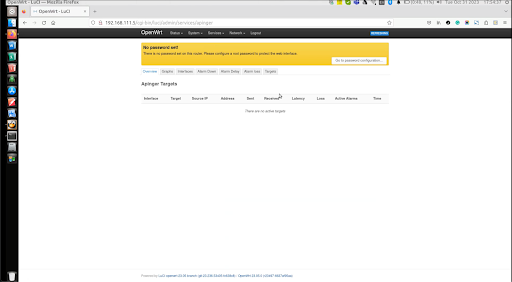

# How to Set-up and Customize Network Monitoring using Apinger

Network monitoring includes continuous network monitoring for common problems like unresponsiveness, slow traffic, or unavailability. Shell scripts or similar tools can monitor the network, but such processes are CPU extensive and have a slower response time since the script needs to run continuously. 

Enter Apinger. Apinger is a tool that overcomes these disadvantages by offering continuous network monitoring that is fast and less resource-intensive. For example, Consider a Cloud-based Service. Cloud services contain various components like servers, databases, etc. Apinger can check the reachability of these services and send alerts when they become unreachable or experience latency issues.

# What is Apinger?

Alarm Pinger (Apinger) is an open-source tool that monitors the availability and quality of a network. It does so by sending periodic pings to the remote hosts. Apinger is also called a “[Daemon](https://www.techtarget.com/whatis/definition/daemon)” process since the service runs continuously in the background. It is available as a software package on the [OpenWrt](https://openwrt.org/start) open-source project. Apinger is a versatile tool installed on Linux, Virtual Machines, OpenWrt, Docker Containers, Custom Hardware, and Windows.

# Why use Apinger?

Apinger has several advantages, such as:

* Lightweight: Apinger is written in C, making it lightweight and resource-efficient.
* Highly customizable: Apinger is an open-source software package. Hence, users can download, install, and configure Apinger to monitor specific IP addresses, set different ping intervals, and define custom alerting criteria.
* Real-time monitoring: Apinger continuously checks the status of the network and can trigger alerts when issues are detected.
* Notification support: Apinger supports various notification methods like email, SNMP traps, and custom scripts to send alerts whenever issues occur.

# Configuring Apinger

Let's now understand how to configure and customize Apinger to monitor a network and set up different alarms.

## Login to the OpenWrt LuCI

The first step is to log in to the OpenWrt Lua Configuration Interface (LuCI). LuCI is a web interface that works with OpenWrt to install and manage packages, configure networks, and all other features of OpenWrt.

1. Enter your OpenWrt credentials on the OpenWrt LuCI to log into your OpenWrt account.


2. Navigate to the System option on the menu bar.


3. Click on Software and click on Update Lists under the Actions tab. This will update the software with the latest packages from the OpenWrt.


4. You will see a pop-up after a successful software update.


## Installing Apinger

The next step is to install Apinger.

1. Once your software is updated, go to the filter option and type Apinger to see the Apinger packages.


2. You can see the package name along with the version, size, and description. Install all the Apinger packages.
3. Once the packages are installed, you can see the Apinger tool appear under the Service menu.


4. Click on Apinger. You will see an empty Apinger dashboard.



As you can see, there are different tabs like Overview, Interfaces, Targets, etc. We will learn about them in a bit.

## Configure the Alarms

Once we have installed the Apinger, the Next step is configuring the alert alarms.

### Configure the Interface

The first step is to configure the Interface. The interface is an interconnection between your target and the network. 

1. Navigate to the Interfaces tab on the Apinger menu bar. You will see that, by default, an interface WAN exists. 


2. You can edit the status update interval and RRD collection interval by clicking edit.


3. Click Save.


### Configure the Targets

Next, we configure the Targets. Targets are the IP addresses you want to monitor. 

1. Navigate to the Targets tab on the Apinger menu bar. You will see the targets dashboard. 


2. No targets are configured. Let's go ahead and Target. Navigate to the Add Target option. Give your target a name and click Add Target. A pop-up appears.

3. Select Interface as WAN. Add your Target IP address. Next, mention the ping interval, average delay, and loss. You can also check the generate RRD graphs checkbox to create graphs.
    1. Ping Interval - Mention the periodic time interval to ping the Target
    2. Average Delay - Mention the delay time
    3. Average Loss - Mention the loss time


4. Click Save.
5. Click Save and Apply.


6. To enable the newly added service, navigate to the Services menu on the OpenWrt menu bar and click Startup.


7. Find the Apinger service and click Enabled and Start.

8. When we start the Apinger service, we can see some activity on the Target by navigating to the Overview tab on the Apinger menu bar. Various details like packets sent and received, latency, and loss are displayed.

### Set-up the Alarms

Now, we set different alarms to monitor our Target and alert according to the configurations.

#### Alarm Down

A Down alarm is triggered when a monitored Target becomes unreachable, unresponsive, or offline. This typically happens when apinger is unable to receive a response to its ping requests. 

1. Navigate to the Alarm Down option on the OpenWrt menu bar. 
2. To add a new Down alarm, give a name and click Add Down Alarm.
3. Add the time in seconds and click Save.
4. Let’s test the Down alarm. We’ll configure another target, “t2,” with the configuration shown in the screenshot. We can see that target “t2” with IP address 1.2.3.4 is set with the “d1” Down alarm that has the Down alarm time as 5 seconds.
5. Go to your command line prompt and ping Target 1.2.3.4.
```
ping 1.2.3.4
```
6. Now you will see that the Down alarm is triggered on “t2” since there was no response from the Target after 5 seconds.

#### RDD Graphs

RDD graphs help you summarize packet loss, packet delay, and latency for that particular target. To view the graphs, navigate to the Graphs option on the Apinger menu bar.

For the previous example of triggering the Down alarm for the “t2” target, we can see a graph being automatically generated.


#### Alarm Delay

A Delay alarm is triggered when the ping packets sent to a Target exceed a predefined threshold time. This threshold is set by the user and is used to monitor network latency. Follow the steps mentioned in the Dwon alarm to set up the Delay alarm.

#### Alarm Loss

A Loss alarm is triggered when Apinger detects packet loss during the ping tests to a Target. Packet loss occurs when some of the sent ping packets do not reach the Target. Follow the steps mentioned in the Dwon alarm to set up the Loss alarm.

Apinger is a versatile and efficient network monitoring service that offers a range of advantages, making it a valuable tool for a wide array of scenarios. Its simplicity, flexibility, and versatility enable you to ensure network reliability and performance, whether at home, in small businesses, or within complex enterprise environments. It can be applied in many use cases, and it's evident that Apinger is an essential component in network monitoring and management. Whether you're a network administrator or an enthusiast, Apinger can help you maintain a stable and high-quality network connection in a much faster, easier, and reliable manner.


# About the Author

Puja has been a technical writer for 3+ years, along with development experience as a Full stack developer. She has a keen interest in web development and AI/ML topics. She has experience writing user manuals, API documentation, blog posts, SEO-focused articles, and more. Away from work, you can catch her traveling, reading books, or cooking! You can connect with her here: [https://www.linkedin.com/in/pujaambalgekar/](https://www.linkedin.com/in/pujaambalgekar/).
